# Technical Mermaid Diagrams Guide

A guide for documenting software architecture and design using Mermaid diagrams in feature designs, delta designs, and decision documents.

## What are Technical Diagrams?

Technical diagrams are visual representations of software concepts like state machines, process flows, component interactions, and data models. They show **structure and relationships** at a conceptual level, not implementation details.

Purpose: Clarify complex concepts that are hard to express in prose alone. Good diagrams complement writing—they should not replace clear explanations.

## When to Use Technical Diagrams

### Include Diagrams For:
- Entity relationships and data models
- State machines and lifecycle transitions
- Multi-step processes with decision points
- Component interactions and integration flows
- Complex data flow through the system

### Skip Diagrams For:
- Simple linear processes (prose is clearer)
- Concepts already clear from prose description
- Implementation details better shown in code
- When the diagram would be more complex than helpful

### Decision Tree

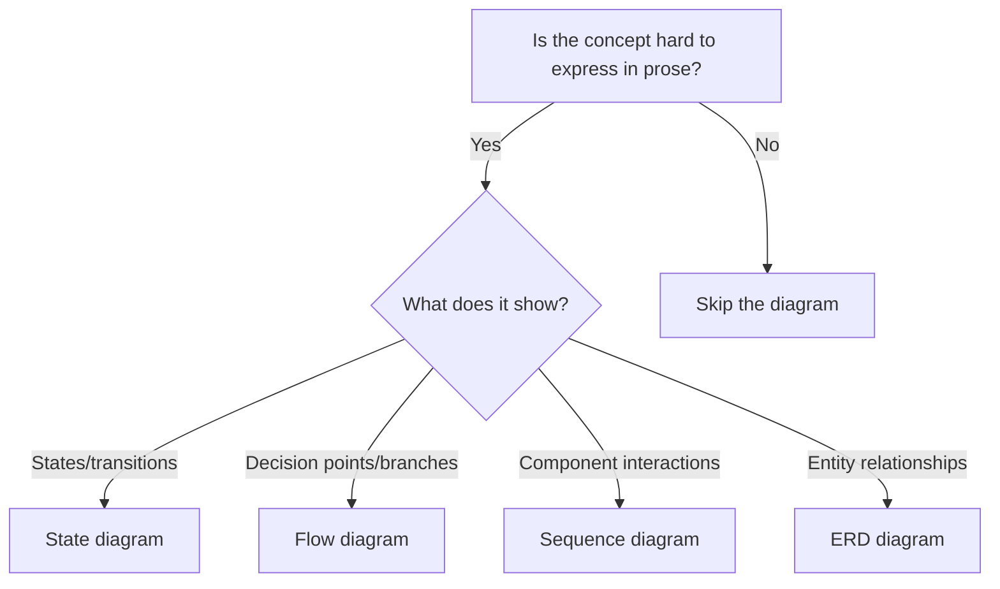

## General Principles

- **Complement prose**: Always include text explanation alongside diagrams
- **Keep minimal**: Show only what aids understanding; omit obvious details
- **Embed inline**: Place diagrams within relevant document sections, not as standalone sections
- **Label clearly**: Use descriptive names, avoid abbreviations without explanation
- **Conditional use**: Delete diagram sections that don't apply to your feature

---

## State Diagrams

### When to Use
- Entities with lifecycle stages (e.g., Order: pending → shipped → delivered)
- State machines with transitions
- Status tracking systems
- Workflow states

### Syntax Reference

```
stateDiagram-v2
    [*] --> State1           // Initial state
    State1 --> State2: event // Transition with label
    State2 --> [*]           // Final state
```

### Basic Example

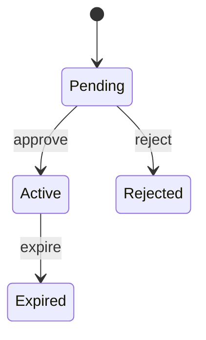

### With Description Template

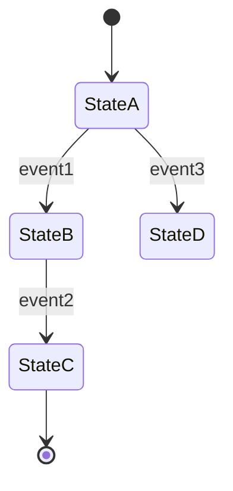

**States**:
- State A: [What this state represents]
- State B: [What this state represents]
- State C: [Final/terminal state]
- State D: [Alternative outcome]

**Transitions**:
- event1: [What triggers this transition]
- event2: [What triggers this transition]
- event3: [When alternative path is taken]

### Do's and Don'ts

**Do**:
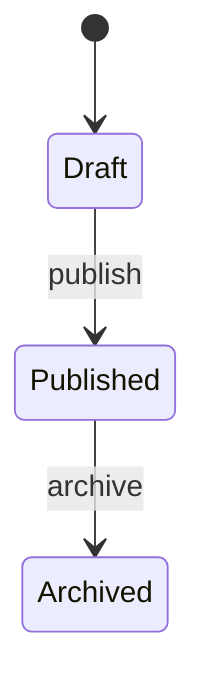
Clear, descriptive state names and transition labels

**Don't**:

Cryptic abbreviations make diagrams harder to understand than prose

---

## Flow Diagrams

### When to Use
- Multi-step processes with decision points
- Algorithm logic with branches
- Conditional workflows
- Decision trees

### Syntax Reference

```
flowchart TD              // TD = top-down, LR = left-right
    A[Step]               // Rectangle for steps
    B{Decision?}          // Diamond for decisions
    A --> B               // Arrow
    B -->|Yes| C          // Labeled arrow
```

### Basic Example

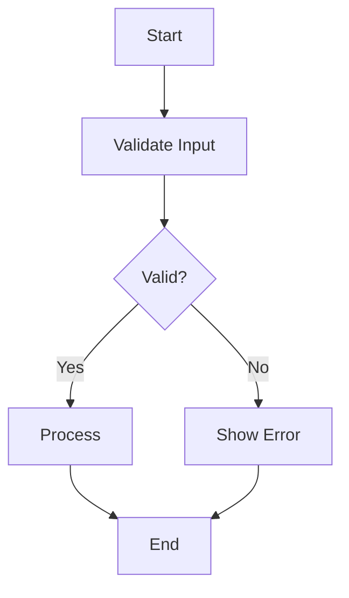

### Complex Process Example

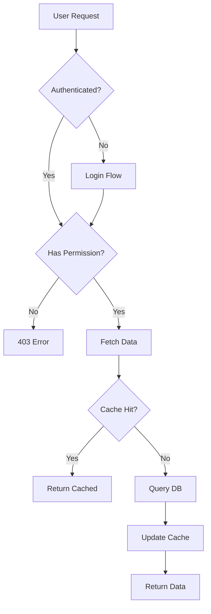

**Process Description**:
- Entry: [When this flow starts]
- Decision points: [Key conditions that branch the flow]
- Exit: [How flow completes]

### Do's and Don'ts

**Do**:
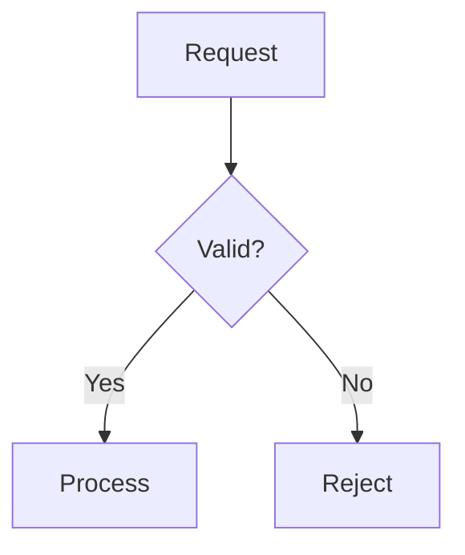
Clear labels, obvious flow direction

**Don't**:
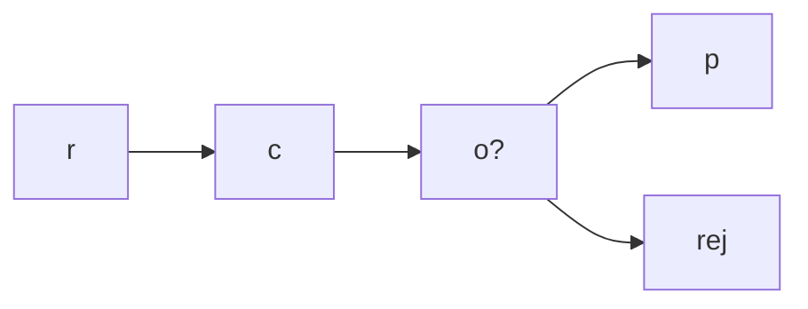
Too terse; unclear what nodes represent

---

## Sequence Diagrams

### When to Use
- Component interactions and message passing
- API request/response flows
- Asynchronous operations
- Integration between systems
- Multi-layer communication

### Syntax Reference

```
sequenceDiagram
    actor U as User          // Stick figure for human users
    participant A as Client  // Box for systems/components
    participant B as Server
    A->>B: request           // Solid arrow (sync)
    B-->>A: response         // Dashed arrow (response)
    A-)+B: async request     // Async message
    B--)-A: async response

    rect rgba(0, 128, 255, 0.1)  // Highlight regions with low-alpha colors
        A->>B: grouped action
    end
```

**Conventions**:
- Use `actor` for human users (renders as stick figure)
- Use `participant` for systems, services, and components (renders as box)
- When using colors (e.g., `rect` for grouping), always use `rgba()` with low alpha (0.1-0.2) to maintain contrast with text and other elements

### Basic Example

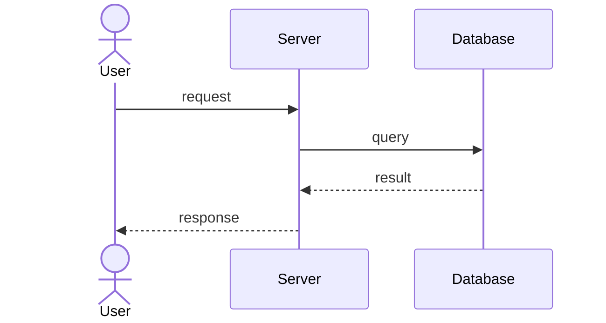

### With Async Operations

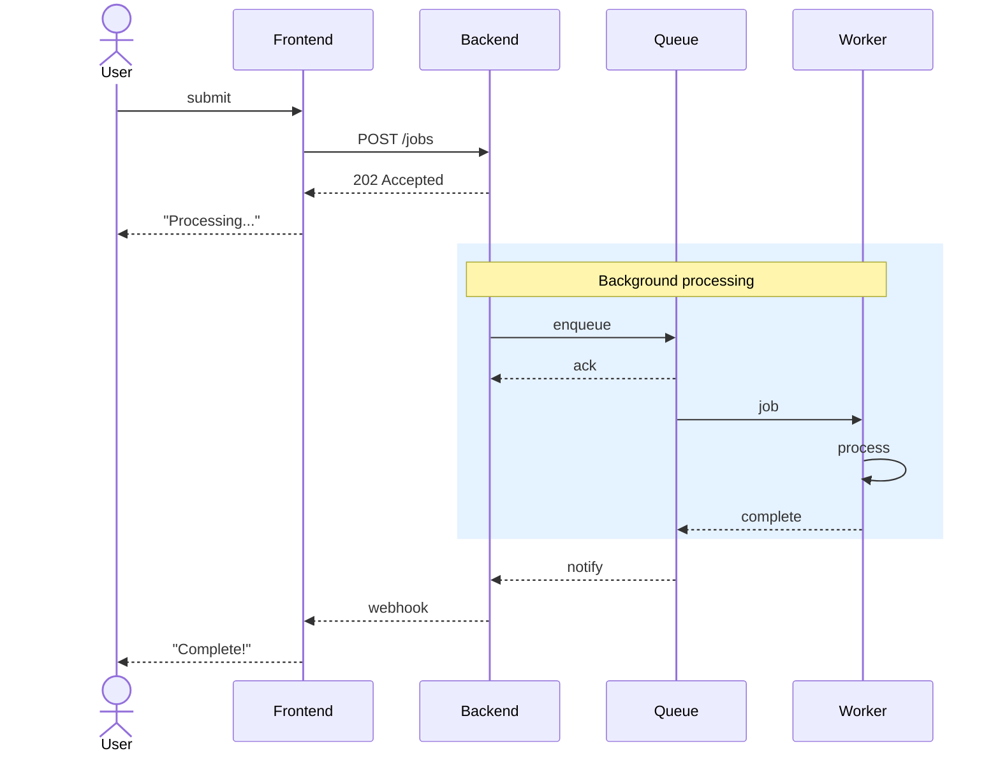

**Participants**: [Explain role of each participant]

**Flow**:
1. [Describe the interaction sequence]
2. [Highlight key async patterns or timing]
3. [Note error handling if relevant]

### Do's and Don'ts

**Do**:
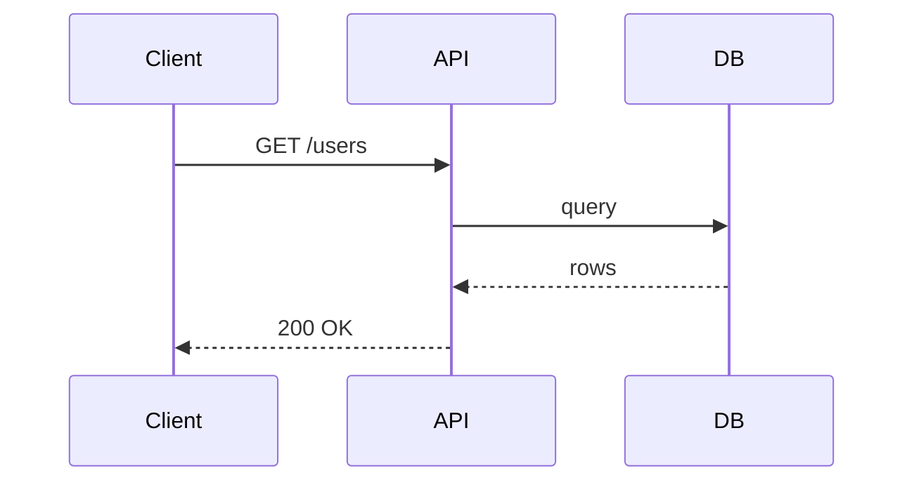
Clear participant names, descriptive messages

**Don't**:
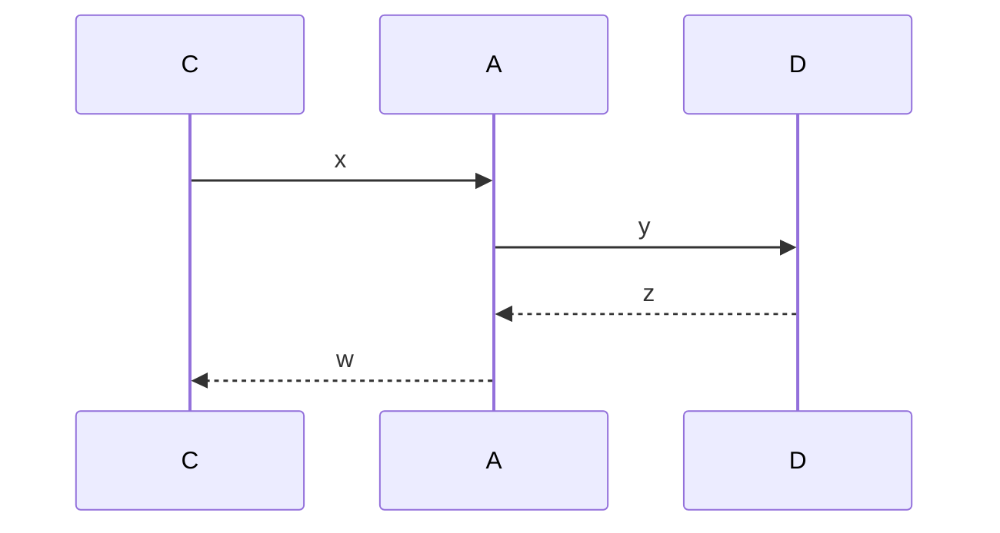
Single-letter names; unclear what messages represent

---

## Entity-Relationship Diagrams (ERD)

### When to Use
- Data model design
- Entity relationships and cardinality
- Database schema documentation
- Domain modeling

### Syntax Reference

```
erDiagram
    ENTITY1 ||--o{ ENTITY2 : "relationship"

    Cardinality:
    ||  exactly one
    o|  zero or one
    }|  one or more
    }o  zero or more
```

### Basic Example

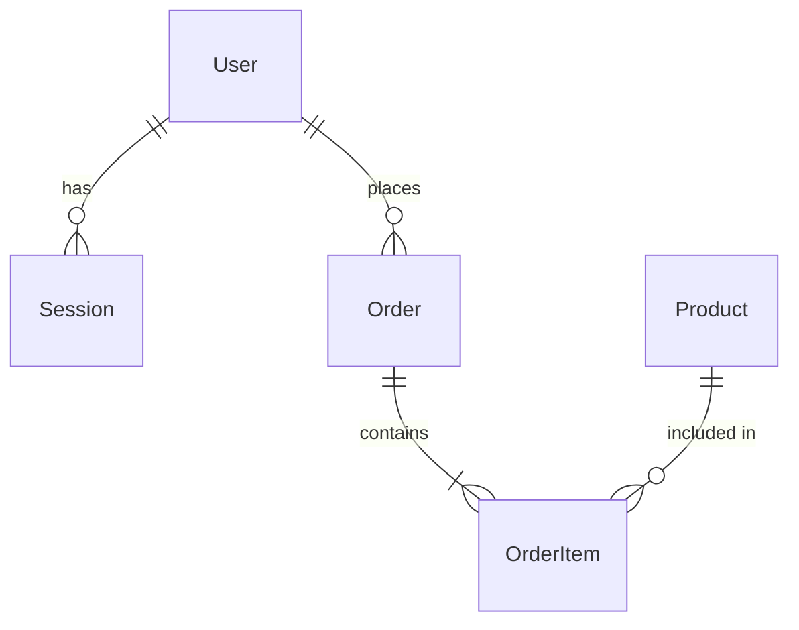

### With Attributes

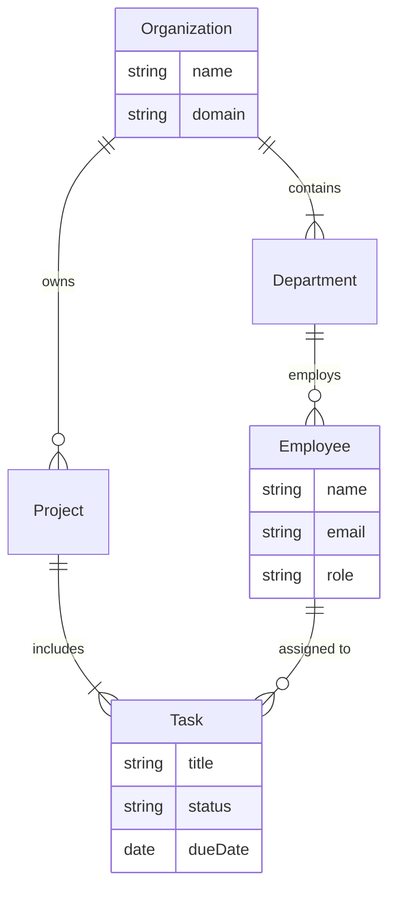

**Entities**: [Explain each entity and its purpose]

**Relationships**:
- User-Session: One user can have many sessions
- Order-OrderItem: An order contains multiple items
- [Explain key relationships and cardinality]

### Nested Structure (Alternative View)

For simple hierarchies, a flowchart can be clearer:

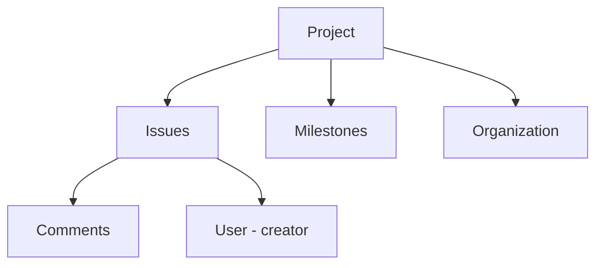

### Do's and Don'ts

**Do**:
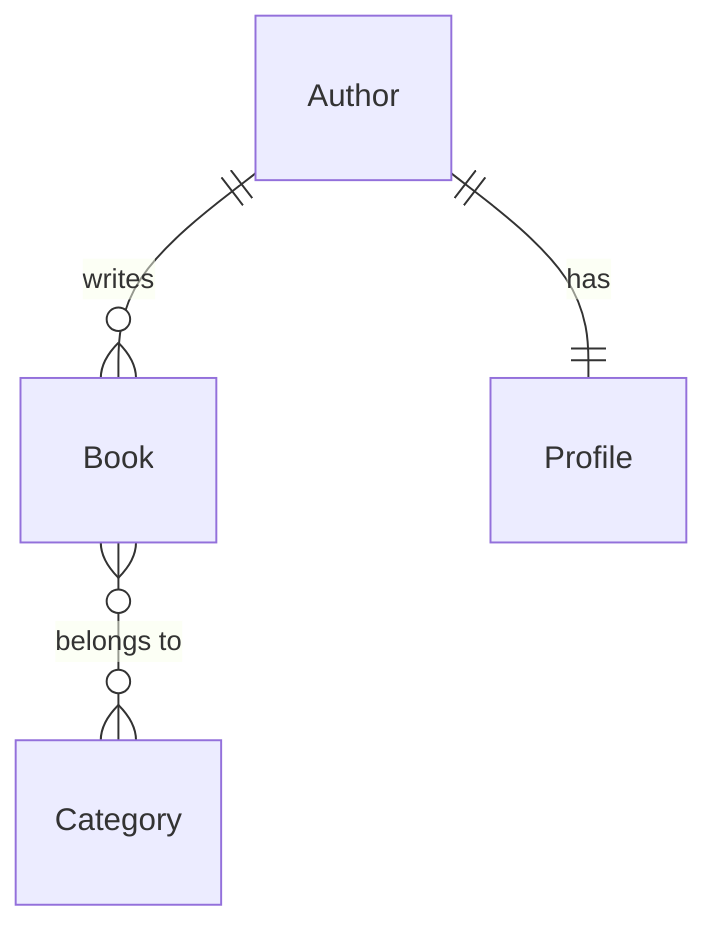
Clear cardinality notation, descriptive relationship labels

**Don't**:
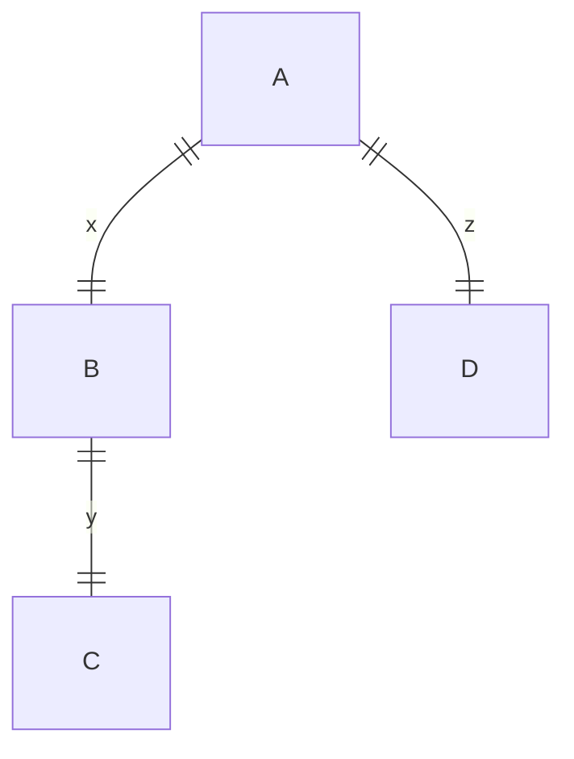
Single-letter entities; meaningless relationship labels

---

## Combining Diagram Types

Sometimes multiple diagram types work together:

### Example: Order Fulfillment

**State Diagram**:
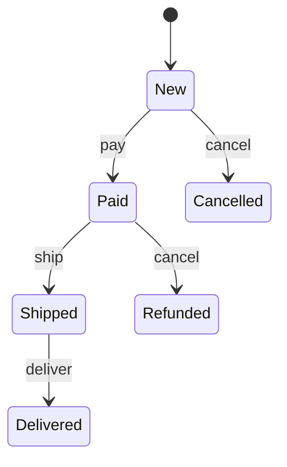

**Data Model**:
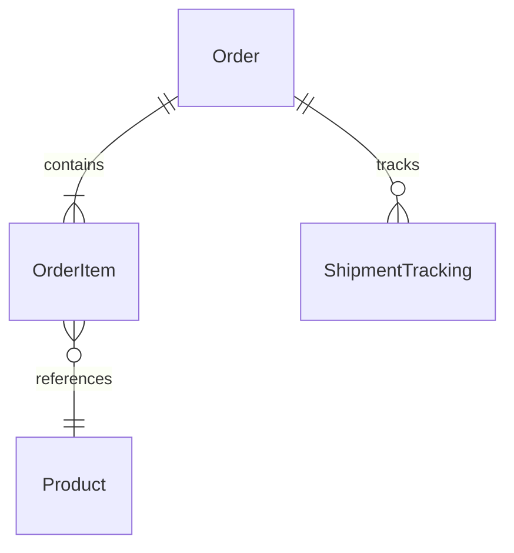

**Sequence** (payment flow):
```mermaid
sequenceDiagram
    actor Customer
    participant Checkout
    participant Payment
    participant Warehouse

    Customer->>Checkout: pay
    Checkout->>Payment: charge
    Payment-->>Checkout: ok
    Checkout->>Warehouse: fulfill
    Checkout-->>Customer: confirm
```

Each diagram shows a different aspect of the same feature.

---

## Best Practices

### Keep Diagrams Minimal
- Show only what aids understanding
- Omit obvious implementation details
- Focus on concepts, not code structure

### Always Add Text Explanations
```markdown
## Data Flow

[Diagram showing flow]

**Description**: [Prose explanation of what the diagram shows and why it matters]
```

### Use Consistent Notation
- Stick to the patterns in this guide
- Don't mix diagram types unnecessarily
- Match the style of existing diagrams in the project

### Embed Diagrams Inline
Don't create a standalone "Diagrams" section. Instead:

```markdown
## Modeling

The system models orders with a clear lifecycle:

[State diagram here]

Orders transition from New to Paid when payment succeeds...
```

### Update Diagrams During Reconciliation
- When reconciling deltas, validate diagrams against implementation
- Remove stale diagrams that no longer reflect reality
- Adjust diagrams to match actual system behavior

### Generic vs Specific
- Use generic examples in DES patterns (pattern essence, not specific code)
- Use specific examples in feature designs (actual domain entities)

---

## Quick Reference

| Need to Show | Use | Syntax Start |
|--------------|-----|--------------|
| Lifecycle stages | State diagram | `stateDiagram-v2` |
| Decision points | Flow diagram | `flowchart TD` |
| Component interactions | Sequence diagram | `sequenceDiagram` |
| Entity relationships | ERD | `erDiagram` |

---

## Integration with Other Guides

- **Breadboarding** (User Flows): Use in specs for user navigation between screens
- **Wireframing** (UI Layout): Use in designs for visual interface structure
- **Technical Diagrams** (this guide): Use in designs for software architecture and data models

Each guide serves a different purpose—use the right tool for the right job.
