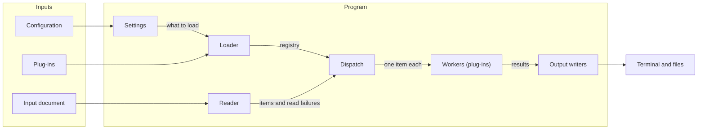

# Component architecture

A branch about what a program is made of: the components a run passes through, what each one owns, what crosses between them, and what comes in and goes out. It is the first branch of a design that introduces a program or a pipeline, and the per-component branches build on it.

## What it covers

The components, named, each with one responsibility stated so that a reader knows which component a later question belongs to. The inputs the program takes and the outputs it produces. What crosses from one component to the next, by name, at the level of "parsed diagrams and parse failures", never a type. The order components run in and whether that order is required or incidental. What is pluggable, and where the plugged-in pieces come from.

It does not cover the shape of anything that crosses between components, that is a contract branch, and it does not cover how any one component derives its result, that is a rules or data-flow branch. Function, module and file names are program design.

## What it needs to question

- Which components exist. One per responsibility; a component that does two things is two, or one with a name that says both.
- What each component owns and does not own, in one sentence each.
- What each arrow carries, and whether the receiving component reads it whole or only part of it.
- Which inputs exist and which component reads each. Which outputs exist and which component writes each.
- The order, and whether it is required: does component B need component A's result, or do they only happen to run in that order.
- Which components are pluggable, what provides a plug-in, and what a plug-in must declare to be found.
- Names. The names chosen here are the names every later branch and note uses; when an earlier document or note used others, they are reconciled to these.

## Representation

A left-to-right flowchart with an inputs subgraph on the left, one subgraph for the program holding its components in run order, and the outputs on the right. Edges carry what crosses. A group of pluggable components is one subgraph with two placeholder members. Then one paragraph per component, in the order of the diagram, stating what it owns and what it hands on.

The prose under the diagram does not restate the arrows. It says what each component is responsible for, what it refuses to do, and which other branch or note holds its detail. A component whose detail is not designed yet is still named here, with its responsibility, so that the later branch has a place to attach.

The runner or main program is the container subgraph, not a box: drawing it as a box turns every component into a spoke around it and hides the order.
