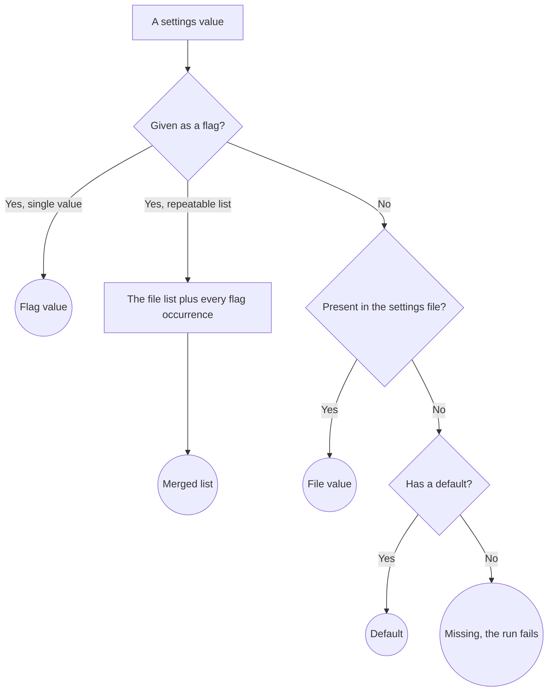
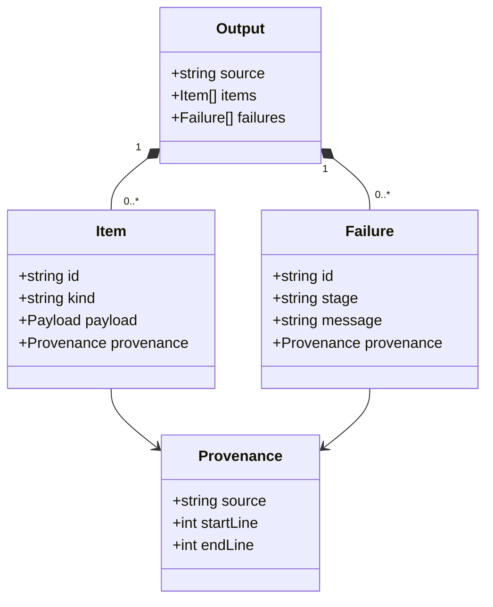

# Contract

A branch about what a component agrees with the rest of the system: what it is given, what it exposes for others to call or register, and what it hands on. Any process has a contract; the branch splits into the parts the component actually has, and a component with no interface or no output simply lacks that part.

## What it covers

Inputs: each value the component is given, where it comes from, whether it is required, what its default is, and how several sources of the same value combine. Interface: each member others call or register through, what question it answers and who asks it. Outputs: the value the component hands on, its parts, what each carries, which are optional and what absent means, and who validates it.

It does not cover how the component derives its output from its inputs, that is a rules branch, nor how a value moves through several components, that is a data flow. It does not cover storage: a value that is persisted is a data model. Type names, function signatures and file formats are program design, except where a format is itself the decision, such as the file a configuration is read from.

## What it needs to question

Inputs:

- Which inputs exist, and which are required. What a missing required input does to the run.
- Where each comes from: an argument, a file, the environment, another component. When several sources can provide the same value, which wins, and whether a list-valued input merges or replaces.
- What the default is when a value is optional and absent.

Interface:

- Which members exist and who calls each.
- What each member answers, and what the caller must declare to use it.
- Whether the interface is closed or pluggable, and what a plug-in must provide to be accepted.

Outputs:

- The parts of the value and what each carries.
- Which parts are optional and what an absent part means, as opposed to an empty one.
- Whether the value is passed as produced or transformed on the way, and whether it has to survive a boundary, a process, a file, a network, that constrains its shape.
- Who validates it, the producer or the consumer, and what an invalid value does.

## Representation

One form per part, each followed by its prose.

Inputs: a table, one row per input, with what it is, where it comes from and whether it is required. When sources combine, a top-to-bottom flowchart of the precedence follows the table.

| Input | What it is | Where it comes from | Required |
|---|---|---|---|
| Document | The file the run reads | Positional argument | Yes |
| Plug-ins | Sources to load | A list in the settings file; a repeatable flag adds entries | Yes |
| Writers | Output writers to run, by name | A list in the settings file; a repeatable flag adds entries | No, one default runs when the list is empty |

Interface: a table of what each member answers and who asks, the same form the note template uses for what a part exposes.

| Member | Answers | Who asks |
|---|---|---|
| Register a worker | Its name and what it accepts | The loader, when it calls a plug-in |

Outputs: a class diagram, one class per part of the value, then prose per part. A class diagram rather than an entity diagram because nothing is stored: there is no nullability comment to carry and no table to name.

The prose for each part states what the table or diagram cannot: what a value means, when it is absent, who validates it and what a failed validation does to the caller.
