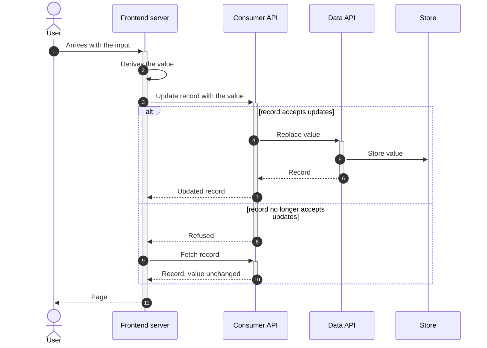

# Data flow

A branch about how a value moves between components: who produces it, which hops carry it, who persists or transforms it, and what happens when a hop fails. It splits into one sub-branch per write path, worked one at a time. A read that has no branching and no transformation is not a flow; it is stated once in the branch's preamble, for instance "the value is a field of the record, so every read returns it".

## What it covers

For each write path: what triggers it, where the value is produced, each hop and whether it passes the value through or changes it, where it is persisted, the order of the steps relative to the other work the same request does, and the fallback when a hop refuses or fails. Interactions between paths when one request can trigger two of them, and which one wins.

It does not cover endpoint names, payload schemas or function names, those are program design. How the value is derived from its input can live inside the path when only that path derives it; when several paths share the derivation, it becomes its own rules branch and the paths refer to it.

## What it needs to question

- Which write paths exist. One per way the value enters or changes, and the read stated in the preamble.
- For each path: the trigger, the producer, whether each hop is a passthrough, where the value is persisted, and what the caller does with the response.
- The ordering inside the request: what runs before the write, what runs after, and what the rest of the request sees.
- Failure: what a refusal or an error at each hop means for the value and for the user, and whether the caller retries, falls back or ignores it.
- Interactions: when one request triggers two paths, which value ends up stored, and whether an existing mechanism (an override, a parameter) carries it or a new one is needed.
- Whether an existing mechanism the path relies on is general or ad hoc, and whether the change generalizes it.

## Representation

One numbered sequence diagram per write path, high level: actors and components, no endpoint or function names, `alt` for the branches the path has. Prose under it that walks the numbers and explains what the diagram does not show: the case where the value is absent, why an order was chosen, what the fallback preserves.

The prose for a path names the steps by number, states what happens when the input is absent, and describes the fallback. It does not compare the path with how the request works today, and it does not describe the other paths.
