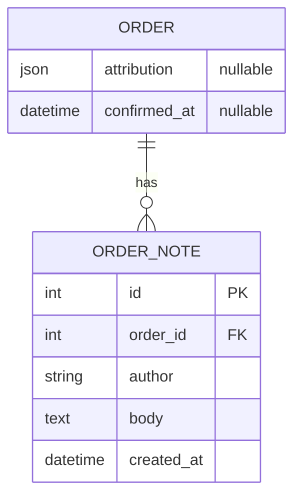

# Data model

A branch about what is stored: a new entity, new fields on an existing one, or a change to the shape of a value. It becomes several sub-branches when the change stores unrelated things that the user wants to reason about separately.

## What it covers

The entities and fields the change adds or alters: type, nullability, the shape of the value when it is structured, what each key means, when the field is empty, and how new entities relate to existing ones. Who owns the shape when the storage does not validate it. What each field is for, in one sentence.

It does not cover how a value gets there, who reads it or what happens when the owning record is copied or updated, those are data flows. It does not cover migrations, ORM declarations or the schemas of the services that carry the value, those are program design.

## What it needs to question

- Where each value lives: which entity, a new field or an existing one, separate from or merged into a field with a similar purpose.
- The type of each field and whether it can be empty, and what empty means.
- For a structured value, the keys it holds, whether all are optional, and the name of any key whose name could be read two ways (for instance a key holding a reduced form of what its name suggests).
- Whether the stored shape is validated where it is stored or only by its producer.
- For a new entity, its relation to the existing ones and its cardinality.

## Representation

A partial ER diagram: the entities the change touches, with only the new or altered fields on entities that already exist and the full field list on entities the change creates. Relations appear when a new entity is involved. Field comments carry nullability, not key lists. The prose says which entities already existed and which the change creates.

Under the diagram, prose in one or two paragraphs per entity: the fields, their type and nullability, the keys of a structured value and what each means, when a field is empty, who validates it, and what it is for. No bullets unless the keys are many. No mention of the fields the entity already has, even when one of them served as the model for the new one.
