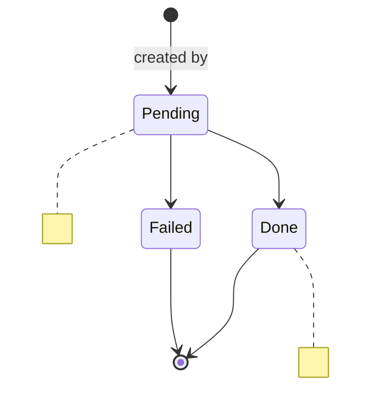

# Lifecycle

A branch about the states one thing passes through, what moves it from one to the next and what each state means for whoever sees it: a tool call from pending to resolved, an order from draft to fulfilled, a step entry from open to answered. The thing is one entity or one message; its movement between components is a data flow, and the shape it carries is a schema.

## What it covers

Each state, what puts the thing into it and what takes it out, which states are terminal, what each state shows or means for its consumers, and what happens after a terminal state. Which transitions are the user's, which the system's.

It does not cover the hops a value takes between services; those are a data flow. It does not cover the value's keys; those are a schema. It does not cover the status column or enum that stores the state, that is a data model.

## What it needs to question

- The states, and which are terminal.
- For each transition, who or what triggers it and what condition it needs.
- What each state shows or means for each consumer, including the interval while a transition is in progress.
- What follows a terminal state.
- Whether a state can be re-entered or a transition repeated.

## Representation

One state diagram, transitions labelled with their trigger, a note per state naming what it shows. The prose under the diagram walks the states from the entry and says what the diagram cannot: why a transition exists, what is deliberately not a state, and which consumer sees which state.

