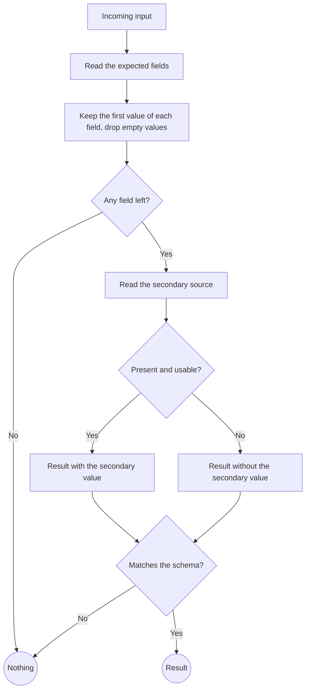

# Rules

A branch about how a value is derived from an input, or how a decision is made: what is read, what is kept, what is dropped, what the result looks like and when there is no result. A rule that only one data flow uses lives inside that flow's sub-branch. A rule that several flows share gets its own branch, and the flows refer to it.

## What it covers

The inputs the rule reads and how it reads them, the transformations it applies or deliberately does not apply, the conditions that produce each outcome, the shape of the result, and the condition under which the result is nothing. Where the rule runs and whether every caller runs the same rule. What a validation failure means for the caller.

It does not cover how the result travels or where it is stored, those are data flows. It does not cover the function or module that implements it, that is program design.

## What it needs to question

- Which inputs are read and how: exact names, what happens with a repeated input, with an empty one, with one that cannot be parsed.
- Whether values are kept verbatim or normalized, and if normalized, how.
- What makes the result nothing, and whether a partial result is allowed or the rule is all or nothing.
- Each exclusion or special case, and whether it is still needed once the other decisions of the design are in place. An exclusion that existed to cover a problem another decision already removes is dropped.
- Whether the result is validated before use, where, and what a failed validation means for the caller.
- Where the rule runs and whether it is one shared rule for every caller or varies by caller.

## Representation

A flowchart of the decision, top to bottom: rectangles for steps, diamonds for conditions with quoted labels, circles for the terminal outcomes. Prose under it for what the diagram does not show: how a field is matched, what verbatim means here, why an outcome is treated as nothing.

The prose does not restate every box. It states the matching rules, the meaning of each terminal outcome for the caller, and the guarantee the rule gives, for instance that a malformed input can never break the flow that calls it.
