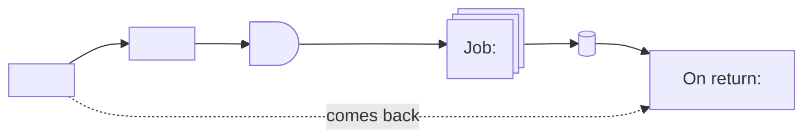

# Scheduled process

A branch about work the system does on its own after time passes, with no request starting it: a job that runs on a schedule, picks the records that meet a condition and acts on each one, or a wait that starts with a user action and ends with the system acting. Closing runs left without activity, cancelling a booking before it starts and confirming a booking after a threshold are scheduled processes.

## What it covers

What starts the process: the schedule it runs on, or the event the wait counts from and how long the wait is. Which records it picks: the condition, the time window, and what marks a record as handled so the next run does not pick it again. What it does to each record, and the existing path the action goes through. The events or messages it sends. Where its parameters live. What the user sees before the process acts and what they see when they come back after.

It does not cover the states the record moves through; those are a lifecycle. It does not cover how the condition is derived from its input; that is a rules branch. It does not cover the column that stores the mark or the parameters; that is a data model.

## What it needs to question

- The trigger: the schedule, or what the wait counts from and its length.
- The candidates: the condition and the window, and how a record already handled stays out of the next run.
- The action: what it changes, and which existing service or path carries the change.
- Whether each record is handled in its own task or all of them in one run.
- The side effects: which events it sends and what they carry.
- Where the parameters live, and who edits them.
- What the user sees before the process acts and after it.
- Whether another process acts on the same records, and whether the order between them matters.

## Representation

One flowchart, left to right, from the user's action to what they see after the process acts: the wait as a `delay`, the job as an `st-rect`, the state it leaves as a `cyl`, the screens as `rect`, and a dotted edge for the user coming back. The prose under the diagram says what starts the process, how it picks its records, what it does to each one and why the wait has that length.

