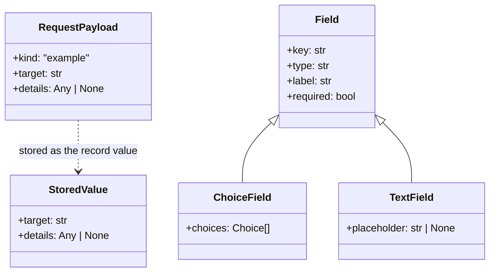

# Schema

A branch about the shape of a structured value that a schema validates rather than a table: the content of a JSON column, a payload that crosses from one system to another, the arguments of a tool, the config of a step. The storage, when there is one, only holds it. It becomes several sub-branches when the change defines unrelated shapes the user wants to reason about separately.

## What it covers

The keys of the value, the type of each, which are optional and what absent means, and the variants when the value is a union. Which schema owns the shape and where it runs: the producer, the consumer, or both with the same rules. What each key is for, in one sentence. When the same shape has a name at each hop, which name each system uses for it.

It does not cover the table or column that holds the value, that is a data model. It does not cover how the value moves between systems, that is a data flow. It does not cover Pydantic models, zod schemas or type names, those are program architecture.

## What it needs to question

- The keys the value holds and the type of each. For a union, the discriminator and the variants.
- Which keys are optional, and what an absent key means as opposed to an empty one.
- Whether a key is typed or accepts any value, and who decides the shape when it is any.
- The name of any key whose name could be read two ways.
- Which systems validate the shape and whether they apply the same rules. What an invalid value does at each.
- Whether the shape is one per kind or configured per instance, for example one payload for every step of a type, or a shape each instance declares in its config.

## Representation

A class diagram, one class per shape, `+key: type` per key with `| None` for an optional key, and a class per variant with the base class as parent when the value is a union. A dotted arrow with a label when one shape becomes another, for example a payload stored as a value. The prose under it says which system produces the value, which validates it, and what each key means; it does not repeat the types.

Under the diagram, one or two paragraphs per shape: what produces it, which keys are required, what an absent optional key means, who validates it and with which rules, and where the value ends up. No table, no nullability comments in the diagram; optionality is in the type.
