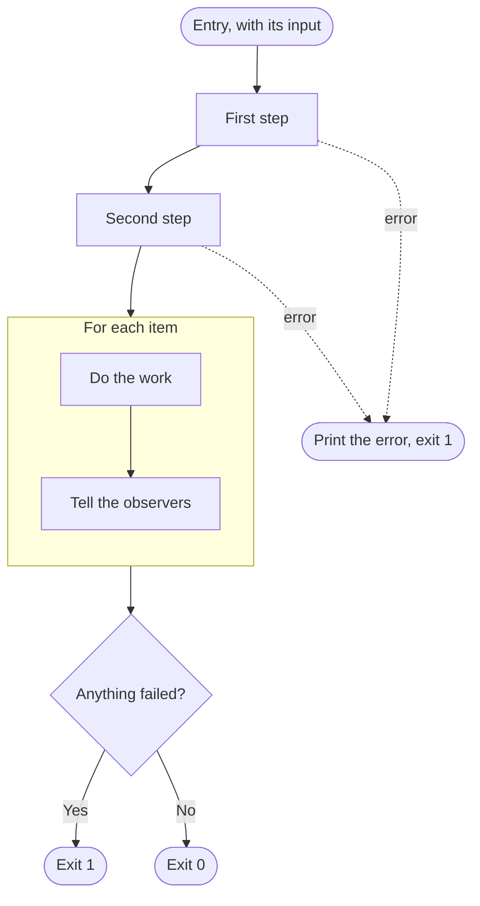
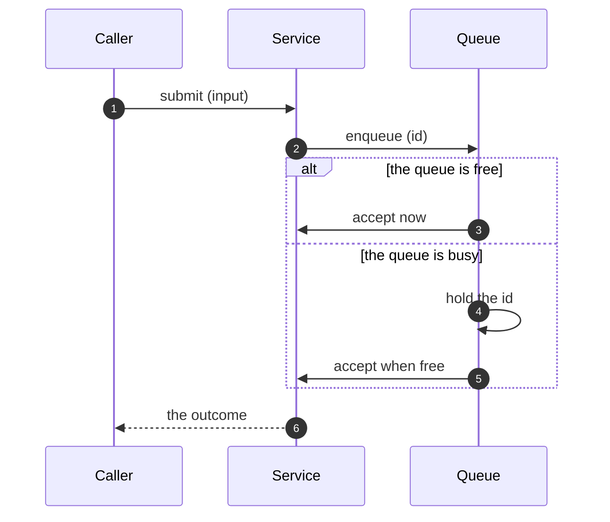

# Control flow

A branch about what a program does between its entry and its exit: the steps in order, which of them can end it, what it counts, and what it hands back to whatever ran it. It follows the branch that names the parts, and precedes the contracts of each one.

## What it covers

The order of the steps and whether the order is required. Which failures end the run and which become results the run carries on with. What the process returns and what a caller can tell from it. What the program does before the parts that produce output exist. What the program itself counts, as opposed to what it delegates.

It does not cover how any one step reaches its result, which is a rules branch, nor the shape of what crosses between steps, which is a contract.

## What it needs to question

- What starts the program and what it is given.
- The order of the steps, and for each pair, whether the second needs the first's result or merely follows it.
- Which failures end the run, and which the run carries as items alongside the successful work. When a failure ends the run before the parts that produce output exist, the program itself reports it, and the answer says how.
- What the process returns, and whether a caller can tell a run whose checks failed from a run that could not happen.
- What the program counts for that outcome, and whether anything it counts is also something an observer reports.
- Whether a repeated step runs its iterations one at a time or together, and whether that is required or incidental.
- What a failure inside an observer does to the run.

## Representation

A top-to-bottom flowchart from the entry node to the terminal nodes, when one actor's steps are the subject. When several actors interact and the interactions are not linear, a flowchart is hard to follow and a sequence diagram is the form instead: the actors as participants, each interaction a message, `alt` blocks for the branches. A repeated step is a subgraph in the flowchart and a `loop` block in the sequence diagram. An edge that ends the run early is dotted and labelled with what went wrong. Then prose walking the diagram, covering what it cannot show: which order is required, what each failure kind does, and what the outcome means.

For a many-actor flow, the sequence shape:

The prose states which steps had to be in that order and which happen to be, since the diagram shows only that they are.
