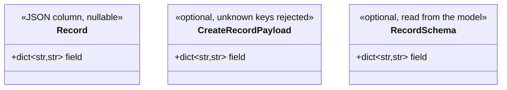

# Class diagram

The program-level form of the design's data model: where the design said an entity gains a field, the class diagram says which declarations gain it and how each one types it.

## What it covers

The stored models and the schemas that carry their fields, as far as the branch adds or alters them. Per declaration, the attributes that change and how each is typed, plus what the type does not say: nullability, the column kind, the policy for unknown keys. When there is a migration, how it is produced and what it adds.

It does not cover call order or decisions, which are the callstack and the control flow, nor the inputs and outputs of an operation, which are the interfaces.

## What to check before proposing

- Read the models and schemas the field passes through, and the precedent the repository already has for a field of the same kind.
- Read how migrations are produced and gated in the repository.
- Check the standards for model and schema declarations and for the migration workflow.

## Representation

A mermaid class diagram, one class per model or schema the branch changes, each carrying only the attributes the branch adds or alters, typed as the language types them. A stereotype line per class carries what the type does not say. Draw nothing else: no unchanged attributes, no methods, no relations unless the branch adds one, and no class for an element the branch reads but does not change.

Validate the diagram before it is shown. The prose under it names, per declaration, the precedent it follows when one exists and what the boundary enforces. It then states once which paths carry the value and what each does with an absent key, a present value and an explicit null. When there is a migration, it says how it is produced, what it adds and what gate it must pass.

## When it fits

A branch that adds or alters fields on declarations that already exist, or adds a declaration whose shape is the change itself: a column and the schemas that carry it, a type shared across a boundary.
