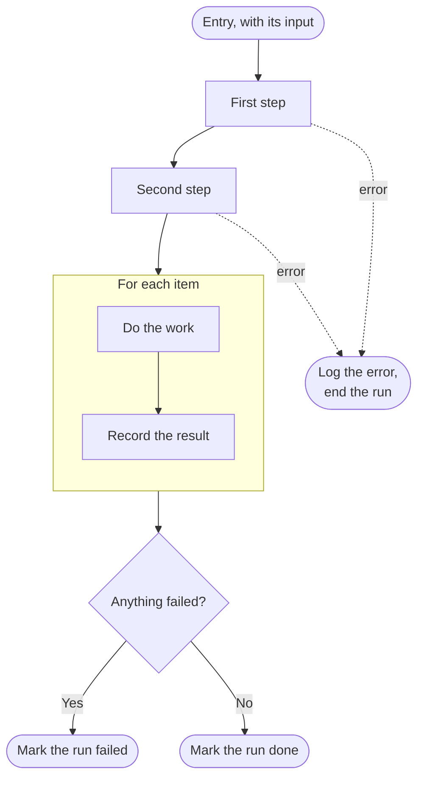
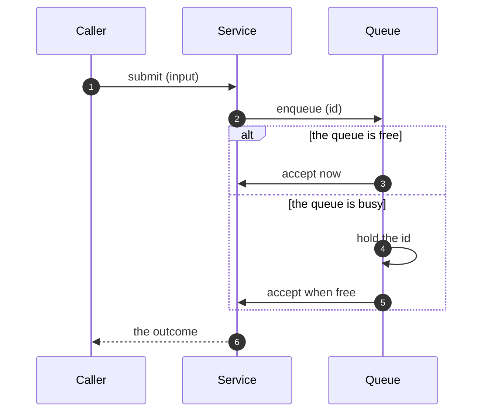

# Control flow

What one entry point does between its start and its end: the steps in order, which of them can end it, and what it hands back to whatever started it.

## What it covers

The order of the steps and whether the order is required. Which failures end the run and which become results the run carries on with. What the run returns and what its caller can tell from it. Whether a repeated step runs its iterations one at a time or together. When several actors are involved, which hands work to which, and on what condition.

It does not cover which functions are called or where a value lands, which is the callstack, nor how a step reaches its result, which is a derivation ledger or prose.

## What to check before proposing

- Read the entry point as it stands: its steps, its error handling and what it returns.
- For a step that waits on another service, a queue or a worker, read the other side's contract.
- Check the standards for how the layer handles errors, retries and return values, so the proposed flow follows them.

## Representation

A top-to-bottom flowchart from the entry node to the terminal nodes, when one actor's steps are the subject. A repeated step is a subgraph. An edge that ends the run early is dotted and labelled with what went wrong.

When several actors interact and the interactions are not linear, a flowchart is hard to follow and a sequence diagram is the form instead: the actors as participants, each interaction a message, `alt` blocks for the branches, and a `loop` block for a repeated step.

Validate the diagram before it is shown. The prose under it covers what the diagram cannot show: which steps had to be in that order and which happen to be, what each kind of failure does to the run, and what the outcome tells whoever started it. Numbered steps in the prose refer to the diagram's numbers.

## When it fits

An entry point whose order is part of the decision: an async job, a message consumer, a scheduled task, a command, or a request that waits on other services. The sequence form fits when the decision is how several services or workers hand work to each other.
