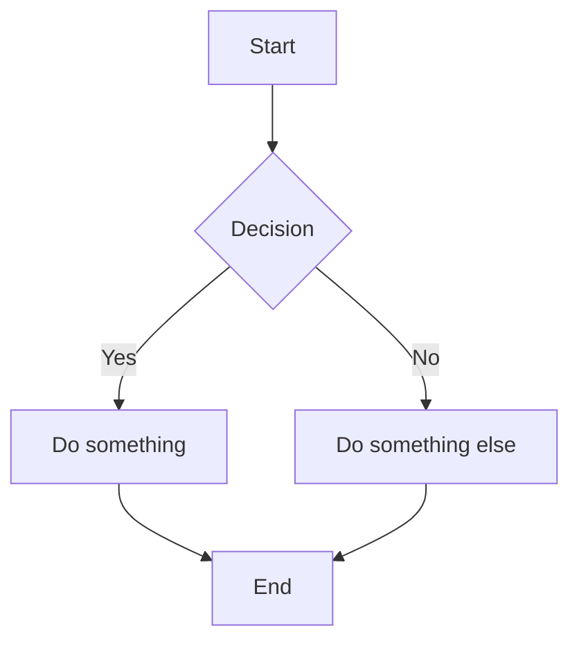

# Show Markdown in Browser

Render markdown content in a browser using a clean, styled HTML page with CDN-based markdown parsing.

## When to Use

Use this skill when the user:
- Asks to display or preview markdown files in a browser
- Wants to see how markdown content looks when rendered
- Requests visual markdown rendering with proper styling
- Needs to quickly view markdown documentation

## How It Works

The skill uses:
- **marked.js**: Fast markdown parser loaded via CDN
- **HTML template**: Pre-styled template with clean CSS
- **Python script**: Generates HTML from markdown and opens it in the browser

## Usage

### Display a Markdown File

```bash
python scripts/display.py <path-to-markdown-file>
```

Example:
```bash
python scripts/display.py README.md
```

### Display Markdown with Custom Title

```bash
python scripts/display.py <path-to-markdown-file> --title "My Title"
```

Example:
```bash
python scripts/display.py README.md --title "Project Documentation"
```

### Display Markdown Content Directly

```bash
python scripts/display.py --content "# Hello\\n\\nThis is **bold** text"
```

Note: Use `\\n` for newlines when passing content via command line.

### Path Resolution

When invoking from Claude Code, use the `${CLAUDE_PLUGIN_ROOT}` variable:

```bash
python ${CLAUDE_PLUGIN_ROOT}/skills/show-markdown/scripts/display.py /path/to/file.md
```

## Workflow

1. Identify the markdown source (file path or content)
2. Run the display script with appropriate arguments
3. Script determines the page title:
   - Explicit `--title` argument (highest priority)
   - First `# heading` from markdown content
   - Filename (without extension)
   - "Markdown Preview" (default)
4. Script generates HTML with embedded markdown
5. HTML opens in default browser via `xdg-open`
6. Temp file is created in system temp directory

## Features

- Fast rendering via marked.js CDN
- Clean, GitHub-inspired styling
- Responsive design
- Code syntax highlighting
- Dark mode support (system preference)
- Temporary file generation (no cleanup needed)
- Smart title detection (explicit → heading → filename → default)
- **Mermaid diagram rendering** (flowcharts, sequence diagrams, Gantt charts, class diagrams, etc.)
- **Click-to-zoom** for mermaid diagrams (opens in modal)

## Technical Details

- **Markdown Parser**: marked.js (https://cdn.jsdelivr.net/npm/marked/marked.min.js)
- **Diagram Rendering**: mermaid.js (https://cdn.jsdelivr.net/npm/mermaid/dist/mermaid.min.js)
- **Syntax Highlighting**: highlight.js (https://cdnjs.cloudflare.com/ajax/libs/highlight.js/11.9.0/highlight.min.js)
- **Browser**: Opens via `xdg-open` (respects system default)
- **Temp Files**: Created using Python's `tempfile.mkstemp`
- **Character Encoding**: UTF-8

## Examples

### Show a README file

```bash
python scripts/display.py README.md
```

### Show a README file with custom title

```bash
python scripts/display.py README.md --title "My Project Documentation"
```

### Show documentation

```bash
python scripts/display.py docs/api.md
```

### Render inline markdown

```bash
python scripts/display.py --content "# Title\\n\\n- Item 1\\n- Item 2\\n\\nCode: `example`"
```

### Render inline markdown with custom title

```bash
python scripts/display.py --content "# Title\\n\\nContent" --title "My Custom Title"
```

## Mermaid Diagrams

The skill supports rendering mermaid diagrams inline. Use fenced code blocks with the `mermaid` language identifier:

````markdown

````

Supported diagram types:
- Flowcharts (`graph TD`, `graph LR`, etc.)
- Sequence diagrams (`sequenceDiagram`)
- Class diagrams (`classDiagram`)
- State diagrams (`stateDiagram-v2`)
- Entity relationship diagrams (`erDiagram`)
- Gantt charts (`gantt`)
- Pie charts (`pie`)
- And more (see [Mermaid documentation](https://mermaid.js.org/))

**Click-to-zoom**: Click on any rendered diagram to open it in a larger modal view. Press Escape or click the backdrop to close.

## Notes

- The browser opens the rendered HTML immediately
- The temp file remains for the browser session
- No manual cleanup required - temp files are managed by the system
- Works best on Linux systems with `xdg-open` installed
- Mermaid diagrams automatically adapt to light/dark mode based on system preference
