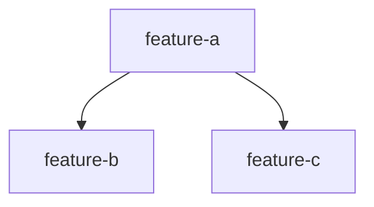

# Roadmap

Per-milestone build order for the product half. Each milestone in `PRODUCT.md` that is being built gets a section here. Order and the dependency graph are decided collaboratively in `/roadmap`; features then flow through `/spec → /design → /implement → /reconcile`.

## Milestone N — <name>

Source: [`PRODUCT.md` Milestone N](../../PRODUCT.md). Each feature links back to the promoted pieces (and thus the source experiments) that justify it.

### Features

| Feature | Depends on | Parallel-safe with | Source evidence | Status |
|---------|-----------|--------------------|-----------------|--------|
| `<feature-slug>` | — | `<other-slug>` | [exp NNN](../../experiments/NNN-slug/README.md) | ✗ Defined |
| `<feature-slug>` | `<feature-slug>` | — | [exp NNN](../../experiments/NNN-slug/README.md) | ✗ Defined |

Status values: `✗ Defined` → `⧗ Spec` → `✓ Spec` → `⧗ Design` → `✓ Design` → `⧗ Implemented` → `✓ Implemented` → `✓ Reconciled`.

### Dependency graph

### Build order

1. `<feature-a>` — no dependencies; unblocks b and c.
2. `<feature-b>`, `<feature-c>` — parallel-safe once a lands.
